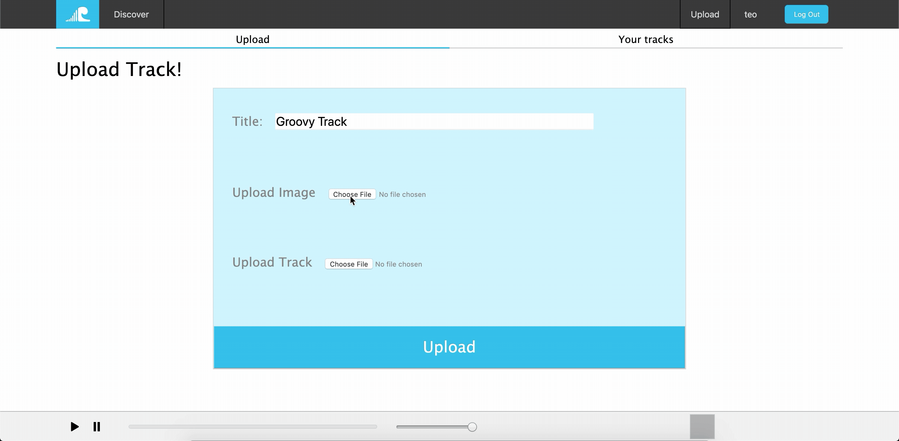
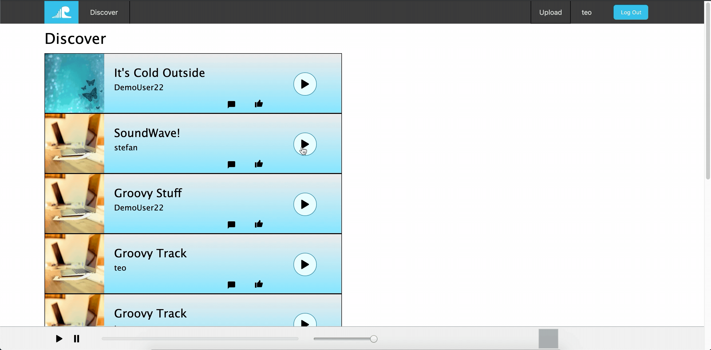

# SoundWave

(https://sound-wave-aa.herokuapp.com/#/ "Live Demo")

SoundWave is a music streaming website inspired by SoundCloud. It shares a lot of 
the same functionality and is similar in style to SoundCloud but has it's own blue 
theme to it. This was my first independent full stack project and was designed and
built within a 3 week timespan, however I plan on continuing to add
more functionality as well as tweaking some of the styling moving forward. 

## Features

- Secure frontend to backend authentication system using BCrypt.
- Users can upload (or delete) their own audio tracks with an accompanying image.
- Users have a library of their own tracks, "Your Tracks".
- Users can view all the tracks that have been uploaded to the site on the "Discover" page.
- Users can leave comments on tracks.
- When a track is played, it populates a music player component which allows for continuous play while navigating around the site. 

### Discover Page

This is the first page that User's see when they login/signup and displays the tracks from all the users on the site. 
It currently displays the tracks in the order that they were uploaded to the site but I plan on revisiting this and 
adding filters to allow for different organizations of the tracks. 

### Upload Track

Validations are set on the database to ensure that both a track and an image file are both 
uploaded and if upload is unsuccessful then errors are rendered. Once a track is uploaded it
populates the "Your Tracks" page. 

### Continuous Play

Continuous play was made easy due to the front end routing provided by React's Hash Router so the 
track itself is never actually interrupted upon switching pages. It did however require some strategy to 
allow for intended play and pause of the current track in the music player while on different pages. 

## Technologies 

- Ruby on Rails (backend)
- React-Redux (frontend)
- Postgresql (database management)
- AWS (data hosting)
- Heroku (domain hosting)

## Design

The design was based off of the SoundCloud website and although I took some noticable liberties 
with some of the styling, I frequently referred back to Soundcloud's website to drum up inspiration.
A prime example of this is the custom logo I added which is a wave with the sort of soundwave 
decoration that is recognized on the SouncCloud logo.

[SoundWave_Logo](app/assets/images/soundwave_logo_img.png)

## Future Features

I plan on adding additional features to the site to increase overall functionality.
These additions are:
 - The ability to like other's tracks
 - A profile page 
 - Filters to display the tracks on the "Discover" page differently
 - Wave forms for the tracks

* **Matteo Santavicca** - *Initial work* - [SoundWave](https://github.com/Tsanta96/soundwave)

## Acknowledgments

* SoundCloud for serving as the key inspiration to this project
* The Instructors at App Academy that were able to offer guidance
